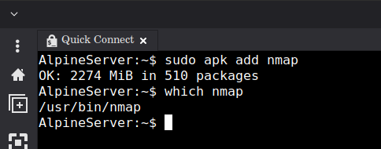
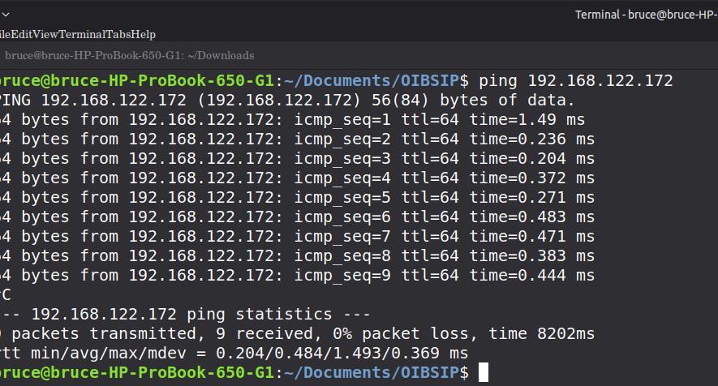
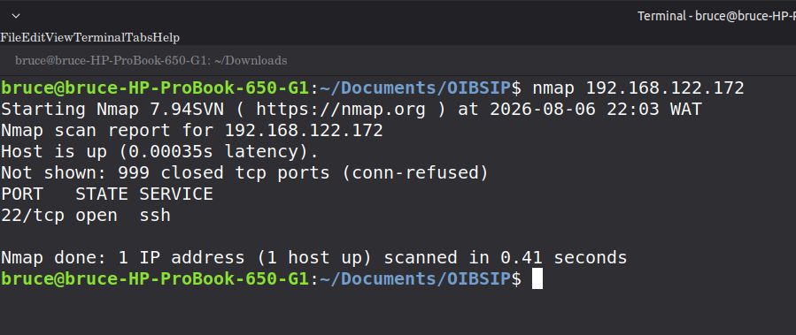
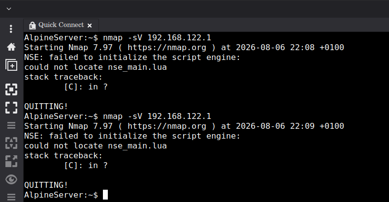
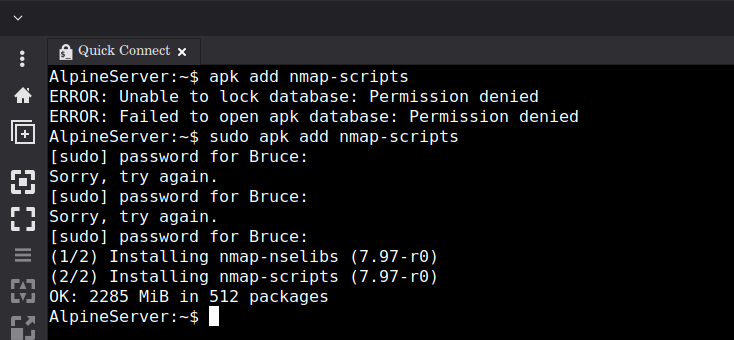
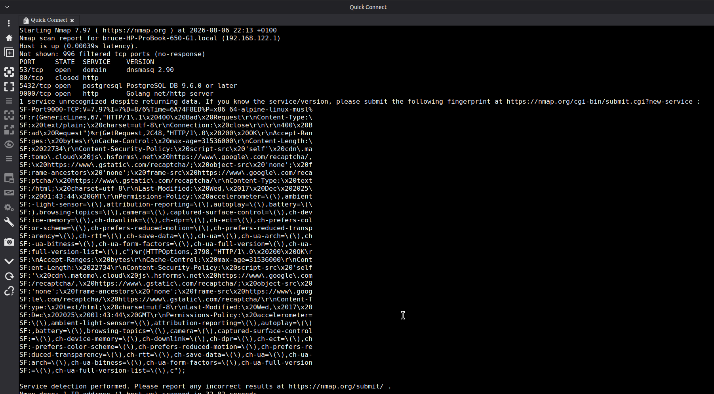
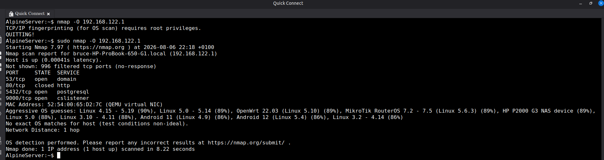
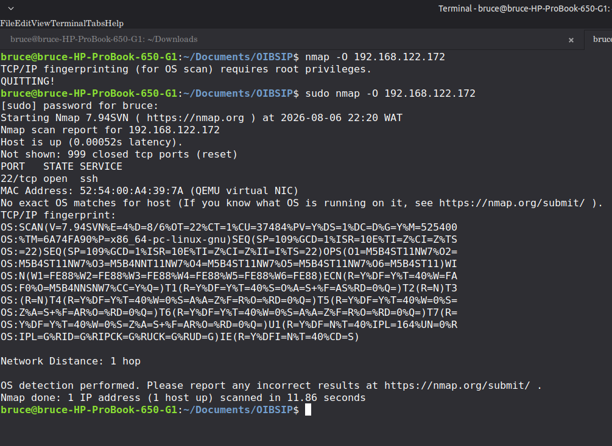

# Task 1: Basic Network Scanning with Nmap

## 🎯 Objective
The primary goal of this task is to perform a comprehensive network scan using **Nmap (Network Mapper)** to identify open ports, detect running services and their versions, and determine the operating system of a target host. This process is fundamental for network reconnaissance and vulnerability assessment.

## 🛠️ Environment Setup
To ensure a safe and controlled environment, the following setup was used:
- **Host Machine:** Linux Mint 22.3 (IP: `192.168.122.1`)
- **Target VM:** Alpine Linux Server (IP: `192.168.122.172`)
- **Network Configuration:** NAT (Network Address Translation)
- **Tools Used:** Nmap, Remmina (for remote SSH access), Terminal.

### 1. Installation & Connectivity
First, Nmap was installed on the Alpine Server using the Alpine Package Keeper:
`sudo apk add nmap`

To ensure the Host and VM could communicate, a bidirectional ping test was performed:
- **Host $\rightarrow$ VM:** `ping 192.168.122.172`
- **VM $\rightarrow$ Host:** `ping 192.168.122.1`

---

##  Execution & Results

### 1. Basic Network Scanning
A basic scan was performed from the Host machine to the Alpine VM to identify open ports.
**Command:** `nmap 192.168.122.172`

### 2. Service Version Detection
To identify the specific software and versions running on the open ports, a service scan was performed from the VM to the Host. 

*Note: During this process, an error was encountered due to missing Nmap scripts. This was resolved by installing the `nmap-scripts` package.*
**Command:** `sudo apk add nmap-scripts`

**Final Service Scan Command:** `nmap -sV 192.168.122.1`

### 3. OS Detection Scan
Finally, an OS fingerprinting scan was executed to determine the target's operating system. This requires root privileges to send raw packets.
**Command:** `sudo nmap -O 192.168.122.1`

---

## 🔍 Security Analysis
The detailed findings of these scans are documented in the accompanying file: `nmap_scan_results.txt`. 

**Key Findings:**
- **Open Ports:** 53 (DNS), 5432 (PostgreSQL), and 9000 (Golang HTTP).
- **OS Identification:** The target was identified as Linux (Kernel 4.15 - 5.19) with high confidence.
- **Risk:** The exposure of the PostgreSQL database on the network interface represents a medium security risk.

---

## ⚖️ Ethical Guidelines
Network scanning can be intrusive and is illegal if performed on systems without explicit authorization. For this project:
1. **Authorization:** All scans were performed on hardware and virtual machines owned and managed by me.
2. **Scope:** The scope was strictly limited to the local NAT network (`192.168.122.0/24`).
3. **Intent:** The purpose of this activity was purely educational to understand network reconnaissance.

**I certify that no external or unauthorized systems were scanned during this task.**