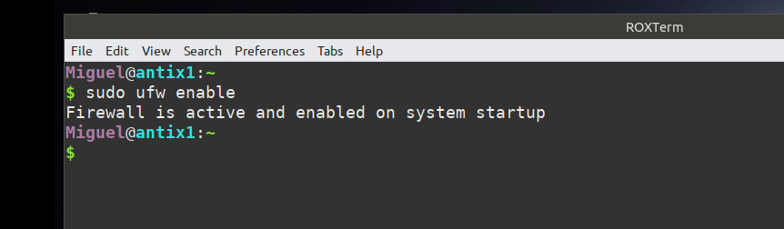
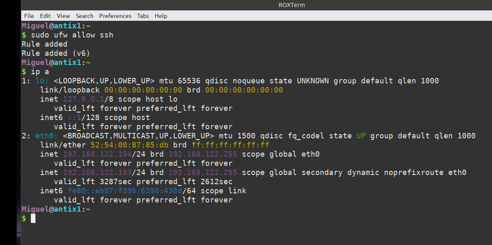
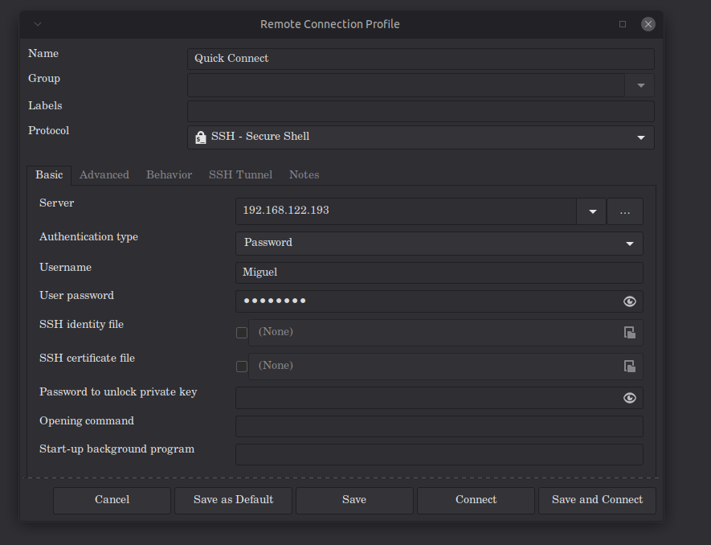
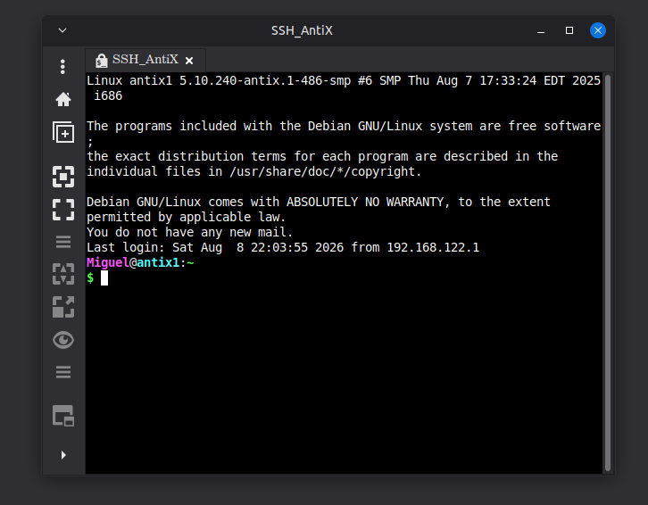
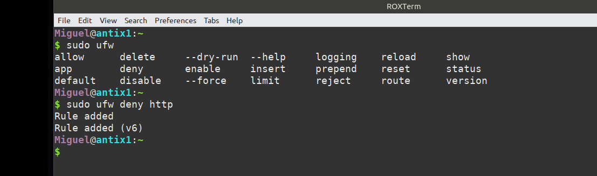
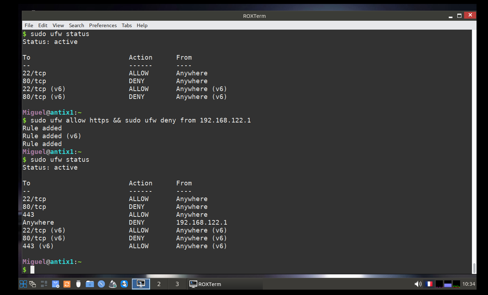
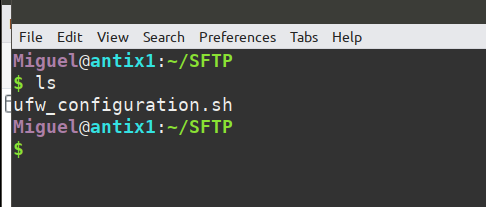
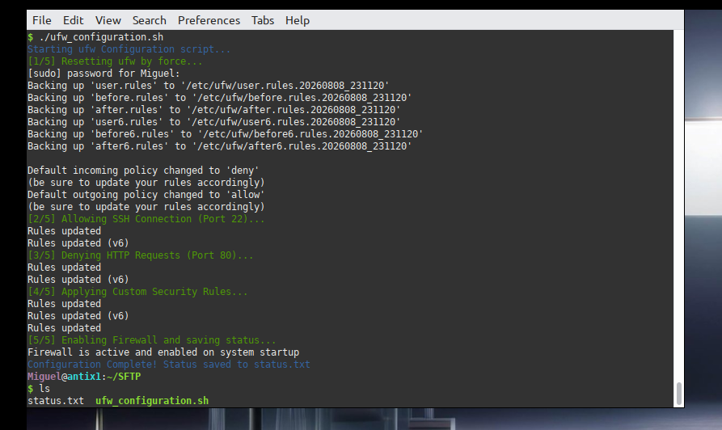
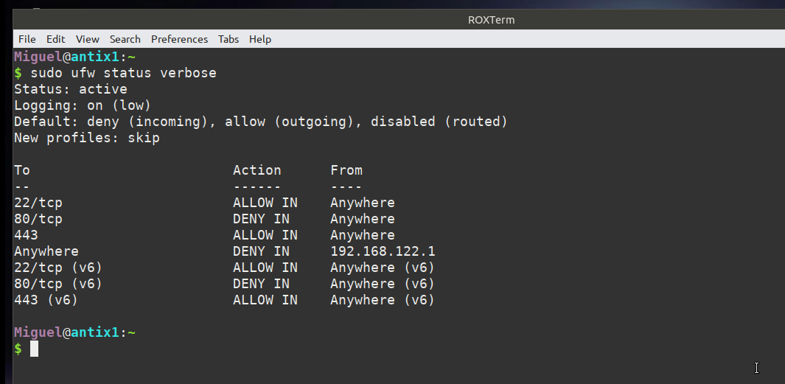

# Task 2: Basic Firewall Configuration with UFW

## 🎯 Objective
The goal of this task is to implement a basic security perimeter using **UFW (Uncomplicated Firewall)**. This involves configuring a set of rules to control incoming and outgoing traffic, ensuring that only authorized services (like SSH) are accessible while blocking potentially dangerous ports (like HTTP) and specific IP addresses.

## 🛠️ Environment Setup
For this task, I utilized a lightweight environment to demonstrate efficiency and resource management:
- **Target System:** AntiX Linux (Lightweight Debian-based distro)
- **Resources:** 1GB RAM
- **Host Machine IP:** `192.168.122.1`
- **AntiX VM IP:** `192.168.122.193`
- **Tools Used:** UFW, Remmina (SSH Client), Nmap, Terminal.

---

## 🚀 Implementation Process

### 1. Installation & Initialization
UFW was installed and enabled to start managing the network traffic of the AntiX VM.
**Commands:**
```bash
sudo apt install ufw
sudo ufw enable
```




### 2. Establishing Secure Access (SSH)
To manage the VM remotely, SSH access was permitted. I verified the VM's IP address using `ip a` and established a connection via **Remmina**.
**Command:** `sudo ufw allow ssh`





### 3. Service Hardening (HTTP/HTTPS)
To reduce the attack surface, I blocked standard HTTP traffic while allowing secure HTTPS traffic.
**Commands:**
```bash
sudo ufw deny http
sudo ufw allow https
```



### 4. The "Lockout" Test (Custom IP Blocking)
To demonstrate the power of IP-based filtering, I created a rule to block my own Host machine (`192.168.122.1`). 
**Command:** `sudo ufw deny from 192.168.122.1`

**Result:** As expected, the firewall immediately dropped all packets from the host, and my active SSH session was terminated (ejected), proving that the rule was applied in real-time.



---

## 🤖 Automation with Bash
To make this configuration reproducible and scalable, I developed a bash script `ufw_configuration.sh`. This script automates the entire process:
1. Resets UFW to a clean state.
2. Sets default policies (Deny Incoming / Allow Outgoing).
3. Applies all required rules (SSH, HTTP, HTTPS, and IP Blocking).
4. Exports the final status to a text file for auditing.

### Script Deployment & Execution
I transferred the script from my host machine to the AntiX VM and executed it with root privileges to apply the security policy instantly.




---

## ✅ Final Verification
The final state of the firewall was verified using the verbose status command.

**Command:** `sudo ufw status verbose`



## 🔍 Security Summary
| Rule | Action | Port/IP | Purpose |
| :--- | :--- | :--- | :--- |
| SSH | ALLOW | 22 | Remote Management |
| HTTP | DENY | 80 | Block Unencrypted Web Traffic |
| HTTPS | ALLOW | 443 | Allow Secure Web Traffic |
| Host IP | DENY | 192.168.122.1 | Simulate Attacker Block/Lockout Test |
