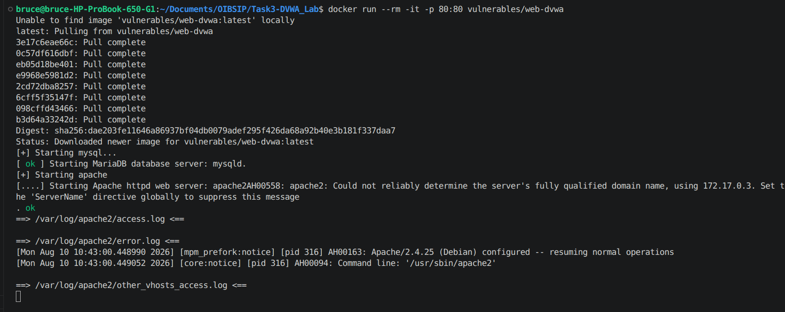
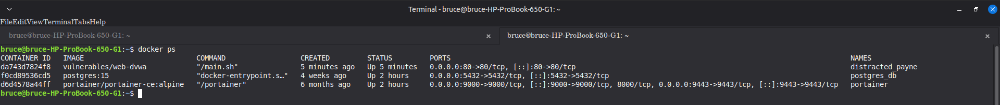
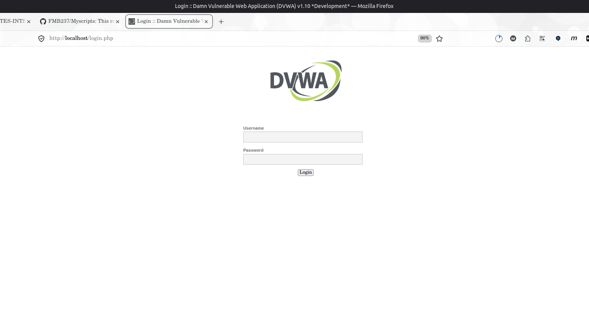
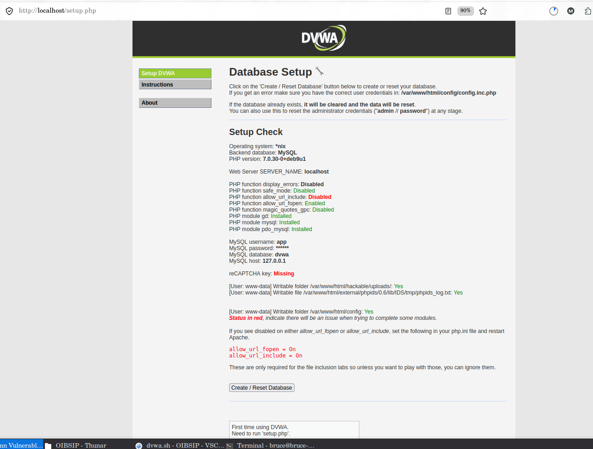
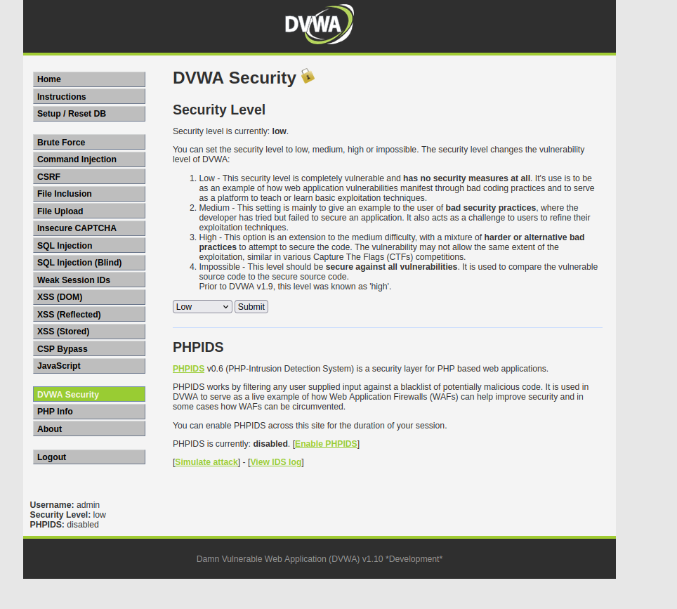
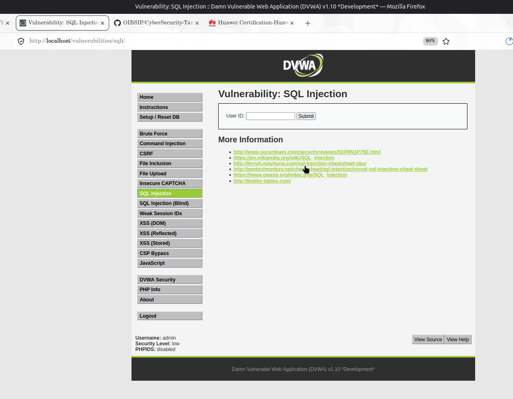
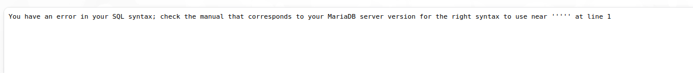
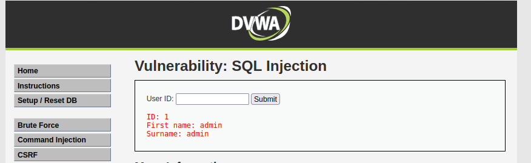
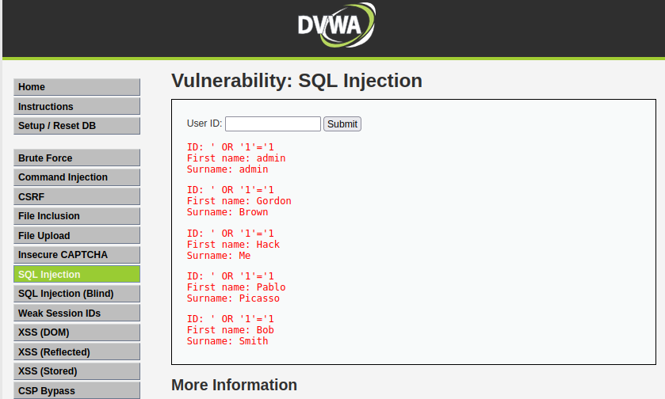

# 🛡️ Cyber Security Internship: SQL Injection Analysis
**Student:** Fouenang Miguel Bruce  
**Role:** Security Analyst Intern @ Oasis Infobyte  
**Project:** Task 3 - SQL Injection on DVWA  
**Environment:** Linux Mint 22.3 / Docker Isolation  

---

## 📝 Project Overview
This project focuses on understanding and demonstrating **SQL Injection (SQLi)** using the **Damn Vulnerable Web Application (DVWA)**. SQL Injection is a critical vulnerability where unvalidated user input is used to alter the backend database logic, allowing attackers to bypass authentication or dump sensitive data.

### Why DVWA?
DVWA is designed specifically for security testing. It allows analysts to practice attacks on different security levels (Low, Medium, High, Impossible) to understand how vulnerabilities are created and how to fix them.

---

## 🛠️ Lab Infrastructure & Setup

### 1. Why Docker?
To ensure a professional and safe workflow, I deployed the lab using **Docker**. This provides several advantages:
- **Isolation:** The vulnerable app is contained, preventing any "mess up" or risk to the host system.
- **Reproducibility:** Containers can be destroyed and recreated instantly.
- **Efficiency:** Faster deployment with minimal memory and disk overhead.

### 2. Environment Provisioning
I provided two scripts in the `/scripts` folder to automate the setup:
- `install_docker.sh`: A custom script I developed to install the Docker Engine on Ubuntu/Mint systems.
- `dvwa.sh`: A helper script to launch the DVWA container quickly and avoid human error.

**Deployment Command:**
```bash
docker run --rm -it -p 80:80 vulnerables/web-dvwa
```
- `-p 80:80`: Maps container port 80 to host port 80.
- `--rm`: Automatically cleans up the container upon exit.

**📸 Setup Evidence:**
- **Pulling Image:** 
- **Container Status:** 

---

## 🚀 Execution Walkthrough

### Step 1: Initial Access & Configuration
1. **Login:** Accessed `http://localhost` using credentials `admin` / `password`.
   
2. **Database Initialization:** Navigated to the setup page and initialized the database.
   
3. **Security Configuration:** Set the **DVWA Security** level to **Low**. At this level, the application performs no input validation or sanitization.
   

### Step 2: Vulnerability Discovery
I navigated to the **SQL Injection** tab. By entering a single quote (`'`) into the User ID field, the application returned a SQL syntax error, confirming that the input is concatenated directly into the query.

**📸 Evidence:** 
- **SQLi Page:** 
- **Error Triggered:** 

### Step 3: The Attack (Data Dumping)
To extract all user records instead of a single ID, I used a **Tautology Payload**.

- **Payload:** `' OR '1'='1`
- **Logic:** The backend query becomes `SELECT ... WHERE user_id = '' OR '1'='1'`, which evaluates to **TRUE** for every row in the database.

**📸 Evidence:**
- **Normal Request (ID 1):** 
- **Successful Exploit:** 

---

## 🛡️ Mitigation & Recommendations
To prevent SQL Injection, the following security controls must be implemented:
1. **Prepared Statements (Parameterized Queries):** The most effective defense. It ensures the DB treats input as data, not executable code.
2. **Input Validation:** Implement strict type-checking (e.g., ensuring User ID is always an integer).
3. **Principle of Least Privilege:** Ensure the web application's database user has the minimum permissions required to function.

---

## 📂 Project Structure
- `/scripts/` $\rightarrow$ Automation scripts (`install_docker.sh`, `dvwa.sh`).
- `/screenshots/` $\rightarrow$ Visual evidence of the entire process.
- `sql_injection_notes.md` $\rightarrow$ Deep-dive technical theory.
- `Personal.md` $\rightarrow$ Personal learning journey and reflections.
- `*.mkv` $\rightarrow$ Video demonstrations of the lab and attack.

---
*Report generated by Fouenang Miguel Bruce - DevSecOps Path*
