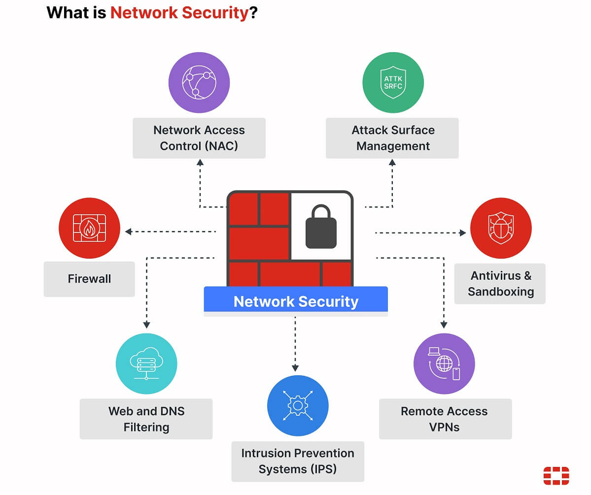
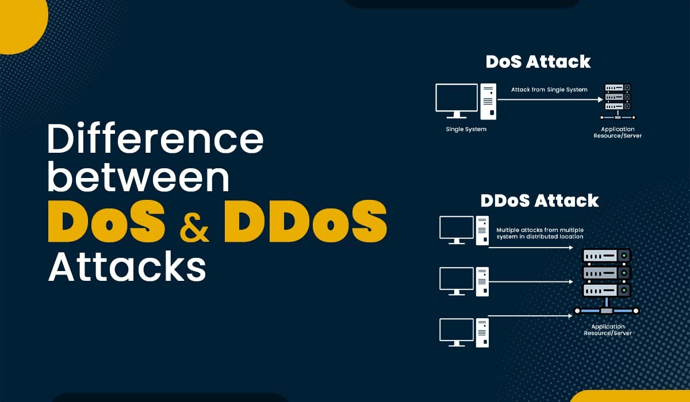
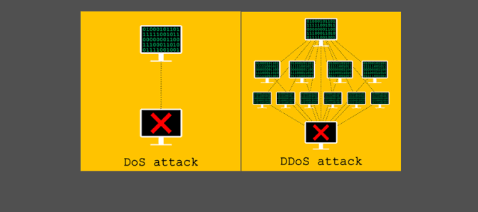
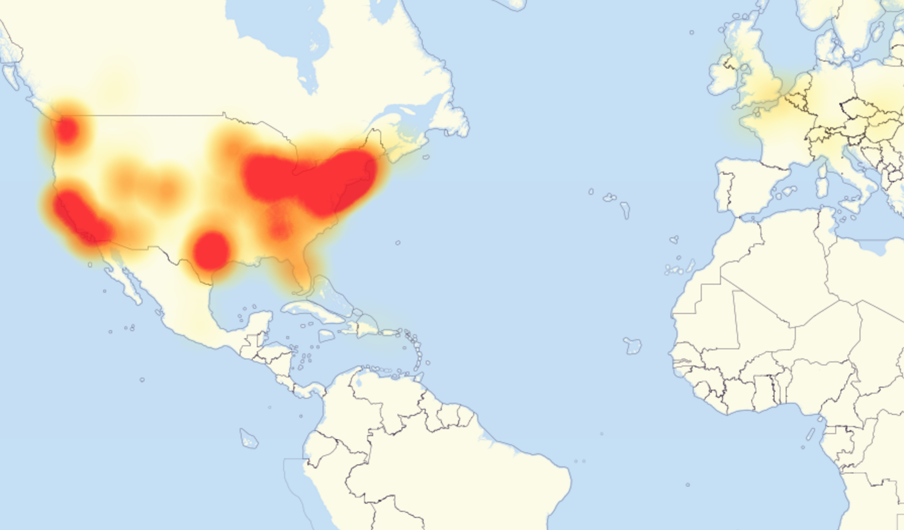
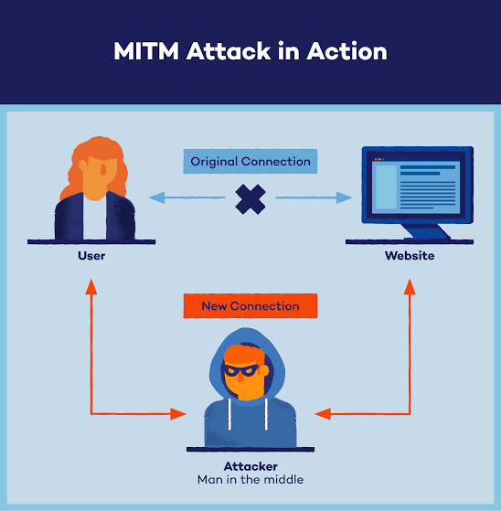
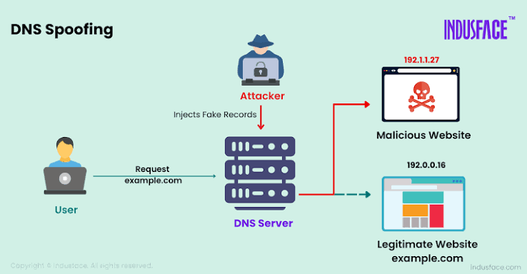
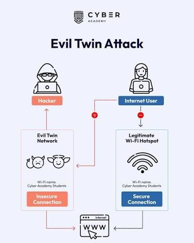
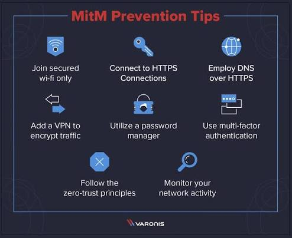
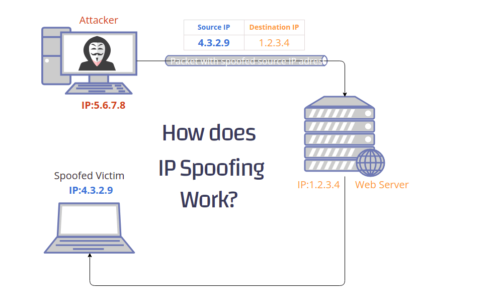
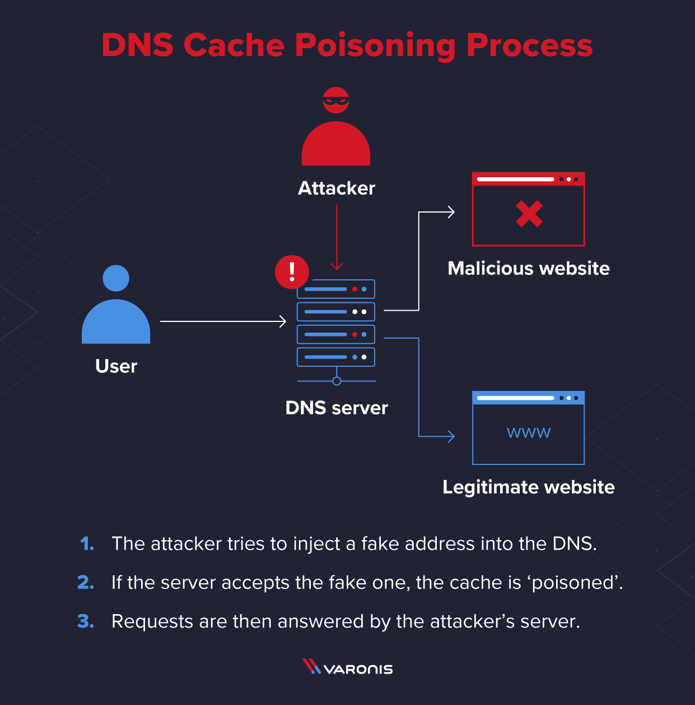

# Report: Common Network Security Threats

**Internship:** Oasis Infobyte | **Track:** Cyber Security
**Author:** Miguel Bruce

---

## 1. Introduction: Why Network Security Matters Today

In an era where digital connectivity drives almost every aspect of daily life—from remote work and global business to personal communication—network security has transitioned from a "luxury" to a critical necessity. 

### Why is it Critical?

* **Expanding Attack Surfaces:** With the rise of hybrid cloud environments, mobile devices, and the Internet of Things (IoT), the number of potential entry points for attackers has grown exponentially. Data no longer stays within a physical office; it travels across various networks and devices.
* **The Shift to Remote Work:** The modern workforce logs in from diverse locations worldwide, making traditional "perimeter-based" security (like a single office firewall) obsolete.
* **The Rise of Ransomware:** Cybercriminals now target critical files and encrypt them, demanding cash for their release. This doesn't just steal data; it halts entire business operations.

### Essential Protection Assets

To combat these threats, organizations must prioritize:

* **Data Integrity & Safety:** Ensuring private customer details and company secrets remain confidential.
* **Financial Stability:** Stopping a breach early prevents massive recovery fees, legal penalties, and loss of revenue.
* **System Uptime:** Robust security prevents sudden crashes and ensures that daily business operations continue without interruption.

---

## 2. Understanding DoS and DDoS Attacks

To understand these attacks, we must first understand the concept of **Resource Limits**. Every piece of IT infrastructure—whether it's a router, a server, or a website—has a finite amount of RAM, CPU, and Bandwidth.

### The Resource Limit Illustration

Imagine a simple blog application deployed on a **VPS (Virtual Private Server)** with:

* **CPU:** 1 vCPU
* **RAM:** 2GB
* **Storage:** 16GB

The app uses **Docker** to run a **Flask** backend and a **PostgreSQL** database. When the app has 10 users, it runs smoothly. However, as the user base grows to 100 or 1,000, the number of requests increases. The database must fire more queries, and the RAM fills up. Once the resource limit is hit, the server crashes. **Attackers exploit this limit intentionally.**

### A. DoS (Denial of Service)

**The Concept:** One Attacker $\rightarrow$ One Target.

**Analogy:** Imagine a small coffee shop with only one cashier. If one person comes in and asks 1,000 complicated questions without ever buying anything, the cashier is stuck. The shop is "open," but no real customers can get their coffee.

**Real-World Scenario: The "Ping of Death"**
In the early days of the internet, attackers sent "malformed" network packets. While a normal packet might be **32KB**, an attacker would send a packet of **128KB**. The server, unable to handle a packet of that size, would either freeze or crash, becoming unavailable to all users.

### B. DDoS (Distributed Denial of Service)

**The Concept:** Thousands of Attackers $\rightarrow$ One Target.

**Analogy:** Instead of one annoying customer, imagine 500 people suddenly rushing the coffee shop at once. They don't even need to ask questions; they just block the doorway. The cashier is overwhelmed, and the shop is physically inaccessible.

#### How it works: The Botnet

Attackers don't recruit people; they recruit **devices**. By using malware, they take control of insecure IoT devices (cameras, DVRs, smart fridges) and turn them into **"Zombies."** The main attacker, known as the **BotMaster**, sends a single command, and the entire army of zombies attacks the target simultaneously.

---

## 3. The Three Main Types of DDoS Attacks

### 1. Volumetric Attacks (The Flood)

**How it works:** This is the most common type of attack. It involves sending massive amounts of data to clog the network "pipe" (bandwidth), effectively submerging the target in traffic.

**Real-World Scenario: The 2016 Dyn Attack**
On October 21, 2016, attackers used the **Mirai Botnet** (thousands of infected IoT devices) to flood **Dyn**, a major DNS provider. Since Dyn acted as the "phonebook" for the internet, when it went down, users couldn't access sites like Twitter, Netflix, or Reddit, even though those websites themselves were functioning perfectly.

### 2. Protocol Attacks (The "Handshake Trick")

**How it works:** These attacks exploit the way network protocols establish connections. The most famous is the **SYN Flood**.

* **Normal TCP Handshake:** 
  Client: "Hello" $\rightarrow$ Server: "Hello back, I'm ready" $\rightarrow$ Client: "Great, let's talk."
* **SYN Flood:** 
  Client: "Hello" $\rightarrow$ Server: "Hello back, I'm ready" $\rightarrow$ **Client stays silent.**

The server keeps a "slot" open waiting for the response. If an attacker does this 10,000 times, the server runs out of available slots and cannot accept any new legitimate users.

### 3. Application Layer Attacks (The "Heavy Request")

**How it works:** These are "low and slow" attacks. They don't require much bandwidth, but they force the server to perform computationally expensive tasks.

**Real-World Scenario: The "Search" Attack**
Imagine a website with a search bar. A normal user searches for "Shoes," and the server finds them in 0.1 seconds. An attacker sends a request for a search that is incredibly complex (e.g., *"Find every product containing the letter 'e' and sort them by date and price"*). 

If the attacker sends 100 of these "heavy" requests, the server's CPU hits 100%, and the site freezes. This is similar to the input-based attacks seen in tools like **DVWA**, where specific inputs can crash or compromise a server.

---

## 4. Man-in-the-Middle (MITM) Attacks

A **Man-in-the-Middle (MITM)** attack is essentially a "Digital Eavesdropping" operation. In a standard connection, a client and a server communicate directly. In an MITM attack, the attacker secretly inserts themselves between the two parties, intercepting the communication without either side knowing.

### The "Fake Mailman" Analogy

Imagine sending a letter to your bank. Normally, the mailman simply delivers it. In an MITM scenario, an **Evil Mailman** intercepts the letter, opens it to read your account details, potentially changes the amount of a payment, reseals the envelope, and then delivers it to the bank. Both you and the bank believe the communication was private and direct.

### Technical Execution Methods

Attackers use several techniques to position themselves in the middle of a connection:

#### A. ARP Spoofing (Local Network Interception)

This occurs primarily on local area networks (LANs) or public Wi-Fi. 

* The attacker sends fake **ARP (Address Resolution Protocol)** messages to the victim's computer, claiming to be the network router.
* Simultaneously, they tell the router they are the victim's computer.
* As a result, all traffic intended for the gateway is routed through the attacker's machine first.

.jpeg)

#### B. DNS Spoofing (The "Wrong Turn" Trick)

Instead of intercepting the connection, the attacker redirects it. By "poisoning" a DNS cache, the attacker forces the victim's browser to resolve a legitimate domain (e.g., `mybank.com`) to a **fake IP address** controlled by the attacker. The victim lands on a perfect replica of the site and enters their credentials.

#### C. Evil Twin (Rogue Access Points)

The attacker sets up a fraudulent Wi-Fi hotspot with a name like **"Free_Airport_WiFi."** Once a user connects, the attacker has full control over the network layer and can monitor every unencrypted packet passing through.

### Impact and Risks

Once the MITM position is established, the attacker can perform:

1. **Eavesdropping:** Stealing passwords, session cookies, and private messages.
2. **Session Hijacking:** Using stolen cookies to bypass login screens and take over active user sessions.
3. **Data Manipulation:** Altering the content of a message or transaction in real-time.

### Defense and Mitigation Strategies

To protect against MITM attacks, the following security measures are essential:

* **End-to-End Encryption (HTTPS/TLS):** The use of SSL/TLS certificates ensures that even if data is intercepted, it is encrypted and unreadable to the attacker.
* **VPN (Virtual Private Network):** A VPN creates an encrypted tunnel for all traffic, rendering "Evil Twin" or ARP spoofing attacks ineffective.
* **Multi-Factor Authentication (MFA):** MFA ensures that even if a password is stolen via MITM, the attacker cannot access the account without the second verification factor.
* **Static ARP Entries:** In high-security environments, administrators can manually map MAC addresses to IP addresses to prevent ARP spoofing.

---

## 5. IP Spoofing

**IP Spoofing** is a technique where an attacker creates Internet Protocol (IP) packets with a modified source address to either hide their identity or to impersonate another computer system.

### The "Fake Return Address" Analogy

Imagine sending a prank letter to someone. Instead of putting your own return address on the envelope, you put the **return address of someone else**. When the victim replies to the letter, they aren't replying to you—they are replying to the person whose address you stole.

### Technical Application

Attackers use IP spoofing for several malicious purposes:

* **Bypassing Access Control Lists (ACLs):** Many networks use "IP-based authentication," trusting any traffic that comes from a specific internal IP address. By spoofing that IP, an attacker can trick the system into granting them access.
* **DDoS Amplification Attacks:** This is one of the most dangerous uses. An attacker sends a small request to a public server (like a DNS or NTP server) but spoofs the source IP to be the **Victim's IP**. The server then sends a massive response to the victim. By doing this with thousands of servers, the attacker can crash a target with very little effort.

### Defense and Mitigation

* **Ingress and Egress Filtering:** Routers can be configured to drop packets that have a source IP that doesn't logically belong on that network interface.
* **Using Encrypted Protocols:** Protocols like SSH and HTTPS use handshakes that are much harder to spoof than simple IP packets.

---

## 6. DNS Poisoning (DNS Cache Poisoning)

**DNS Poisoning** occurs when an attacker manages to introduce false information into a DNS resolver's cache, causing the resolver to return an incorrect IP address for a domain.

### The "Wrong Phonebook" Analogy

Imagine the city's official phonebook. A hacker sneaks into the printing office and changes the phone number for "The National Bank" to their own phone number. Now, whenever anyone looks up the bank's number in the official book, they call the hacker instead, thinking they are talking to the bank.

### How the Attack Works

1. **The Request:** A user asks their DNS resolver for the IP of `example.com`.
2. **The Race:** The resolver asks the authoritative DNS server for the answer. The attacker, anticipating this, sends a **fake response** faster than the real server can.
3. **The Poisoning:** The resolver accepts the fake response and saves (caches) the attacker's IP address.
4. **The Redirection:** For the duration of the cache's "Time to Live" (TTL), every user using that resolver is redirected to the attacker's malicious website.

### Defense and Mitigation

* **DNSSEC (DNS Security Extensions):** This is the primary defense. It adds digital signatures to DNS records, allowing the resolver to verify that the information is authentic and hasn't been tampered with.
* **Shortening TTL (Time to Live):** Reducing the time a record stays in the cache limits the window of time an attacker can redirect traffic.
* **Using Trusted DNS Providers:** Using providers with robust security infrastructures (like Cloudflare or Google DNS) reduces the risk of poisoning.

---

## 7. Summary Comparison Table

| Threat | Attack Vector | Who is at Risk? | Difficulty to Execute | Ease of Mitigation |
| :--- | :--- | :--- | :--- | :--- |
| **DoS/DDoS** | Network/App Layer | High-traffic servers, APIs | Medium (Botnets) | Medium (CDN/WAF) |
| **MITM** | Local Network/Wi-Fi | Public Wi-Fi users, LANs | Medium | High (HTTPS/VPN) |
| **IP Spoofing** | IP Header Manipulation | Trust-based networks, ACLs | Medium | Medium (Filtering) |
| **DNS Poisoning** | DNS Cache/Resolver | All internet users | High | High (DNSSEC) |

## 8. Conclusion: Key Takeaways for Network Administrators

1.  **Defense in Depth:** No single tool is enough. A combination of firewalls, encryption (TLS), and monitoring is required to cover all vectors.
2.  **Zero Trust Architecture:** Never trust a packet just because it comes from an "internal" IP. Implement strict authentication and verification for every request.
3.  **Continuous Monitoring:** Attacks like DDoS and MITM are often only detectable through anomalies in traffic patterns. Real-time logging and alerting are non-negotiable.

## 9. References

*   **NIST (National Institute of Standards and Technology):** Special Publications on Network Security and Guide to DDoS Mitigation. [nist.gov](https://www.nist.gov)
*   **CISA (Cybersecurity & Infrastructure Security Agency):** Alerts and Technical Guides on DNS Spoofing and Social Engineering. [cisa.gov](https://www.cisa.gov)
*   **MITRE ATT&CK Framework:** Technical documentation on Adversary Tactics and Techniques (T1566 - Phishing, T1557 - Adversary-in-the-Middle). [attack.mitre.org](https://attack.mitre.org)
*   **OWASP (Open Web Application Security Project):** Top 10 Web Application Security Risks and Prevention Cheat Sheets. [owasp.org](https://owasp.org)
