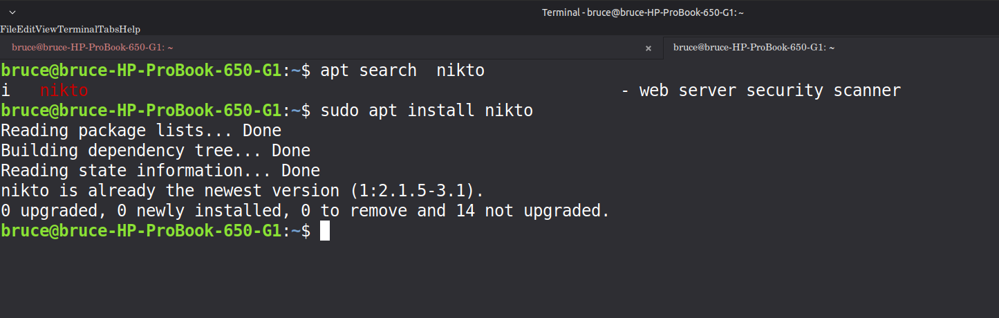
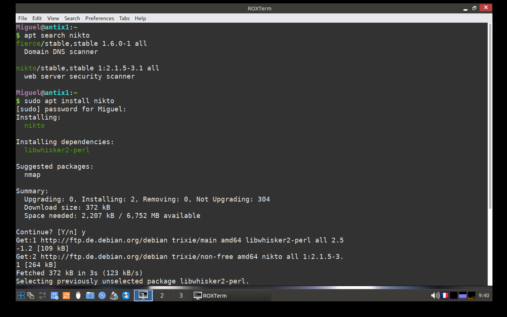
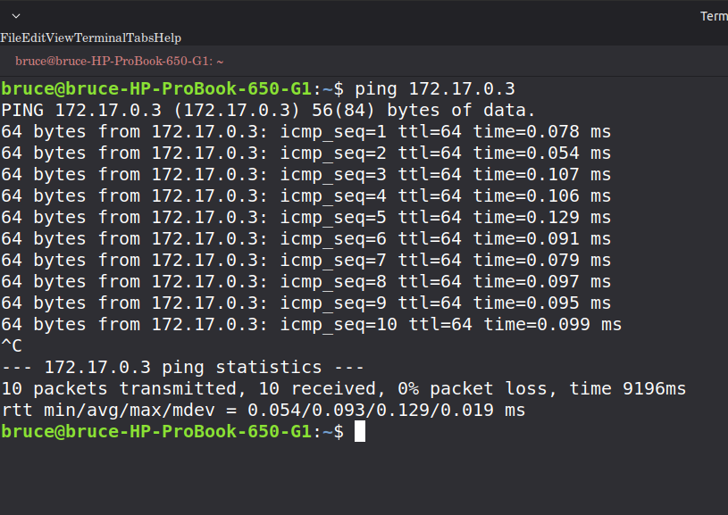
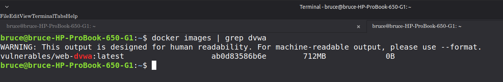
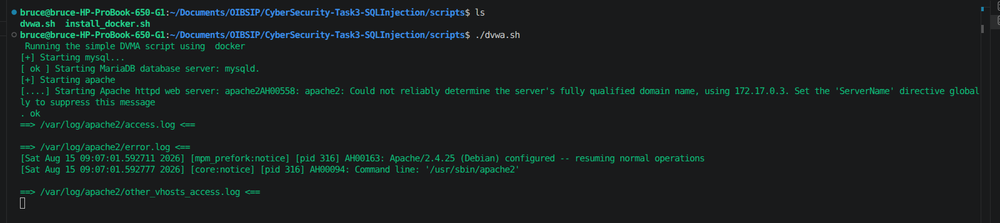
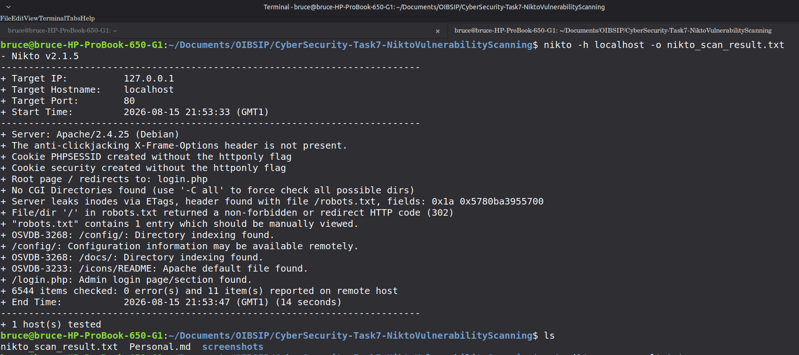
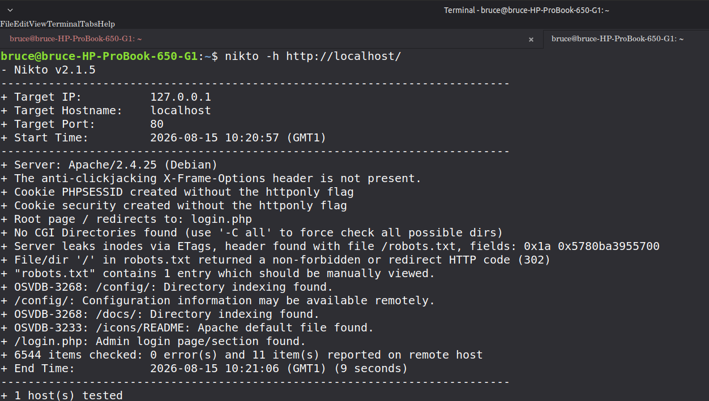

# 🛡️ Cyber Security Task 7: Web Vulnerability Scanning with Nikto

## 📌 Project Overview
This project is part of the Oasis Infobyte Cyber Security internship. The goal was to perform a comprehensive vulnerability scan on a deliberately vulnerable web application (**DVWA - Damn Vulnerable Web Application**) using **Nikto**.

The objective was to identify security misconfigurations, outdated software, and dangerous files that could be exploited by an attacker.

---

## 🧪 Lab Journey & Methodology
Based on my personal lab notes, I followed a structured approach to ensure the environment was secure and reachable:

1.  **Environment Reuse:** I leveraged the DVWA Docker container previously set up in Task 3 (SQL Injection) to maintain a consistent test environment.
2.  **Cross-Platform Testing:** I installed Nikto on both my **Linux Mint host** and an **AntiX Linux VM** to test tool behavior across different environments.
3.  **Network Verification:** Before scanning, I verified connectivity between the host and the VM using `ping` to ensure the Docker container (IP `172.17.0.3`) was reachable.
4.  **Automation:** I developed a custom Bash script (`nikto_scan.sh`) to move from manual scanning to an automated, professional audit process.

### 📸 Setup Evidence
| Installation (Host) | Installation (VM) | Network Ping | DVWA Reminder |
| :---: | :---: | :---: | :---: |
|  |  |  |  |

---

## 🛠️ Technical Setup
- **Target Application:** DVWA (Deployed via Docker)
- **Scanning Tool:** Nikto v2.1.5
- **Host OS:** Linux Mint 22.3
- **Infrastructure:** Docker Container (Port 8000)

### 🚀 Automation Script
I developed a Bash script to automate the scanning process, ensuring all results are logged for evidence:
- **Full Server Baseline Scan:** Comprehensive check of the entire web server.
- **Targeted Configuration Scan:** Using `-Tuning 1,x` to hunt for interesting files and config leaks.
- **Automated Logging:** Results are saved in `./scan_results/`.

---

## 📊 Vulnerability Analysis

After analyzing the scan results in `full_server_scan.txt`, the following critical vulnerabilities were identified:

| Finding | Severity | Security Impact | Remediation |
| :--- | :---: | :--- | :--- |
| **Missing X-Frame-Options** | 🟡 Medium | Vulnerable to **Clickjacking** attacks. | Add `X-Frame-Options: DENY` to server headers. |
| **Missing HttpOnly Flag** | 🔴 High | Enables **Session Hijacking** via XSS. | Set `session.cookie_httponly = 1` in `php.ini`. |
| **Directory Indexing Enabled** | 🔴 High | **Information Leakage** in `/config/` and `/docs/`. | Disable listing using `Options -Indexes`. |
| **Admin Login Found** | 🟡 Medium | Exposure of `/login.php` for Brute Force. | Implement Rate Limiting or MFA. |

### 📸 Scan Results Evidence

---

## 🔍 Nikto vs. Nmap: The Difference

| Feature | Nmap (Network Mapper) | Nikto |
| :--- | :--- | :--- |
| **Primary Goal** | Port Scanning & Service Discovery | Web Application Vulnerability Scanning |
| **Layer** | Network/Transport Layer (L3/L4) | Application Layer (L7 - HTTP/HTTPS) |
| **What it finds** | Open ports, OS version, services | Outdated versions, dangerous files, XSS/SQLi |
| **Analogy** | Checking if the doors/windows are open. | Checking if the locks are old or the safe is open. |

---

## 📂 Evidence & Artifacts
- **Scan Logs:** Located in `/scan_results/`
- **Screenshots:** Located in `/screenshots/`
- **Demo Video:** `Task7_Nikto_Scan.mp4`

## 🏁 Conclusion
The scan successfully identified several high-risk misconfigurations. By implementing the suggested remediations, the attack surface of the application can be significantly reduced.
