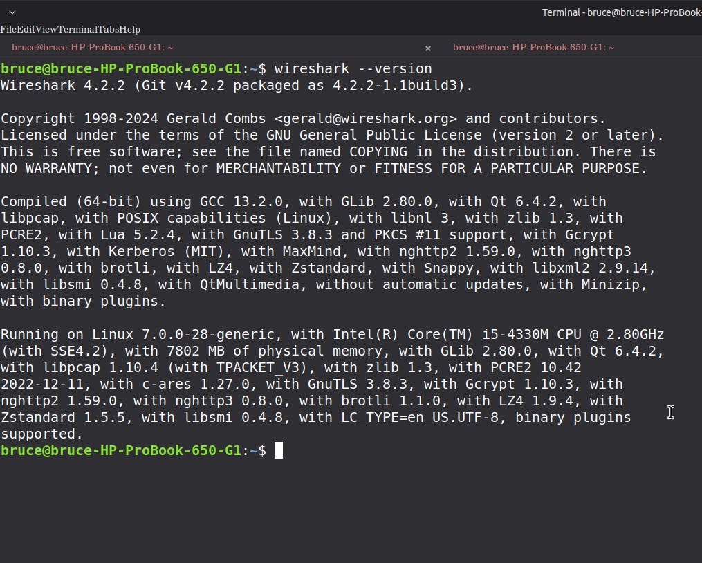
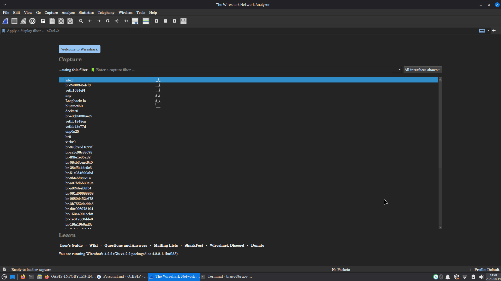
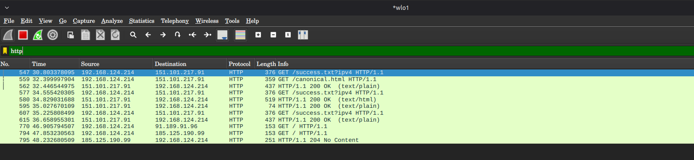
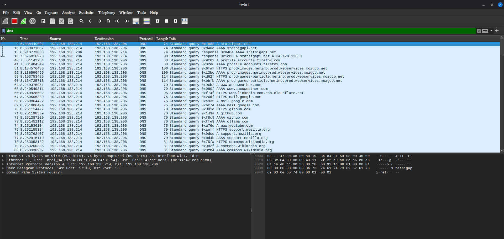
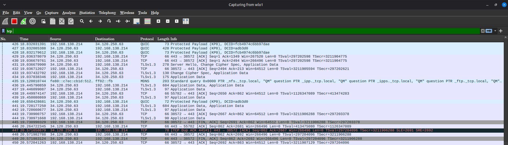
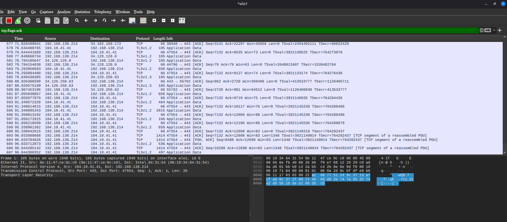
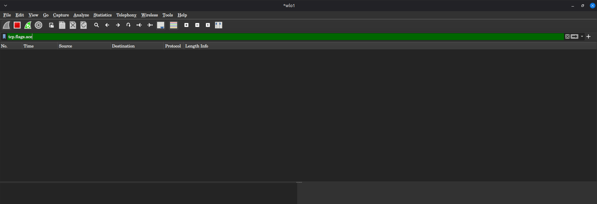

# Task 8: Capture Network Traffic with Wireshark

**OASIS Infobyte SIP - Cyber Security Track**
**Task:** CyberSecurity-Task8-NetworkPactureWithWireshark
**Student:** Miguel Bruce
**Date:** 22/08/2026

## Table of Contents

- [Objective](#objective)
- [Tools & Environment](#tools--environment)
- [Setup & Installation](#setup--installation)
- [Lab Procedure](#lab-procedure)
- [Findings](#findings)
  - [Wireshark Version & Dashboard](#wireshark-version--dashboard)
  - [HTTP Traffic Capture](#http-traffic-capture)
  - [DNS Traffic](#dns-traffic)
  - [TCP 3-Way Handshake](#tcp-3-way-handshake)
  - [Unencrypted Data Exposure](#unencrypted-data-exposure)
- [Security Analysis](#security-analysis)
- [Glossary](#glossary)
- [Remediation Recommendations](#remediation-recommendations)
- [Deliverables](#deliverables)
- [Conclusion](#conclusion)

## Objective

Capture live network traffic using Wireshark, apply display filters to isolate specific protocols, analyse packet contents, and document findings with security observations. The main aim is to capture network traffic with Wireshark and demonstrate understanding of packet analysis, TCP 3-way handshake, and risks of unencrypted HTTP traffic.

## Tools & Environment

- **OS:** Linux Mint 22.3 XFCE [Host] + AntiX VM
- **Network Interface:** wlo1 [Wi-Fi], Docker bridge interfaces
- **Target:** DVWA container running locally for controlled HTTP traffic
- **Tools:** Wireshark, Terminal, Docker
- **Capture Files:**
  - `Scan_result.pcapng` [2.2 MB]
  - `Wireshark_Capture.pcapng` [966 KB]
  - `tcpflagssyn_scan.pcapng` [163 KB]

## Setup & Installation

Wireshark was installed on Linux Mint host:

```bash
sudo apt update
sudo apt install wireshark -y
sudo dpkg-reconfigure wireshark-common
sudo usermod -aG wireshark $USER
```

Logout / restart required to apply group permissions.

Version check:

```bash
wireshark --version
```



Launch:

```bash
wireshark
```

Wireshark dashboard shows all network interfaces including wlo1 and Docker bridge networks.



## Lab Procedure

1. **Lab Setup**
   
   - Host machine: Linux Mint
   - VM: AntiX for isolated testing
   - DVWA container launched to generate controlled HTTP traffic
   - Capture performed on host interface to monitor traffic to DVWA server

2. **Capture**
   
   - Started capture on selected interface
   - Generated traffic for minimum 2 minutes by browsing to DVWA and performing HTTP requests
   - Saved capture as `Scan_result.pcapng` and `Wireshark_Capture.pcapng`

3. **Filtering & Analysis**
   
   - **HTTP filter:** `http`
   - **DNS filter:** `dns`
   - **TCP filter:** `tcp`
   - TCP 3-way handshake identified via SYN, SYN-ACK, ACK sequence

## Findings

### Wireshark Version & Dashboard

Wireshark installed and running successfully. Dashboard shows interfaces: wlo1, docker bridges.


### HTTP Traffic Capture

Filter applied: `http`

HTTP packets captured from DVWA container traffic. Unencrypted HTTP GET/POST requests visible in clear text.



**Security Observation:** HTTP traffic is unencrypted. Username, password and form data can be read directly from packet payload. This demonstrates eavesdropping risk on local network.

### DNS Traffic

Filter applied: `dns`

DNS queries and responses captured showing domain resolution for web requests.



### TCP 3-Way Handshake

Filter applied: `tcp`

Complete TCP connection establishment observed:

- **SYN** - Client initiates connection
- **SYN-ACK** - Server acknowledges
- **ACK** - Client confirms







This confirms proper TCP connection establishment before data transfer.

### Unencrypted Data Exposure

From HTTP capture, request headers and form data are visible in plain text under `Hypertext Transfer Protocol` and `HTML Form Data` sections. Sensitive credentials transmitted over HTTP can be intercepted by any attacker on the same network segment.

## Security Analysis

**Why unencrypted HTTP is dangerous:**

- Data travels in clear text, readable by anyone with packet capture capability
- Credentials, session cookies, and personal data exposed to MITM attacks
- No integrity protection - packets can be modified in transit

**How HTTPS prevents this:**

- TLS encryption encrypts payload between client and server
- Certificate validation ensures authenticity
- Prevents eavesdropping and tampering

## Glossary

- **Packet:** Smallest unit of data transmitted over a network, containing header and payload
- **Protocol:** Set of rules governing data transmission, e.g., TCP, HTTP, DNS
- **Port:** Logical endpoint number used to identify specific service on a host, e.g., 80 for HTTP
- **Payload:** Actual data carried by a packet, excluding headers
- **Handshake:** Negotiation process to establish connection parameters, e.g., TCP 3-way handshake SYN -> SYN-ACK -> ACK

## Remediation Recommendations

- Always use HTTPS/TLS for web applications
- Implement network segmentation and monitoring
- Use VPNs on untrusted networks
- Enable firewall rules to restrict unnecessary traffic
- Regularly audit traffic for unencrypted protocols

## Deliverables

- `Scan_result.pcapng` - Main 2+ minute capture
- `Wireshark_Capture.pcapng` - Additional capture
- `tcpflagssyn_scan.pcapng` - TCP SYN analysis
- Screenshots in `screenshots/` folder
- Demo video: `Task8.mp4`
- Personal notes: `Personal.md`

## Conclusion

This task successfully demonstrated live network traffic capture with Wireshark, protocol filtering, TCP handshake analysis, and identification of unencrypted HTTP risks. The lab confirms the importance of encryption and secure protocols in modern network security.

---

**Ethics Note:** All captures performed on networks and systems owned or explicitly authorized for testing. DVWA used in isolated local environment only.
